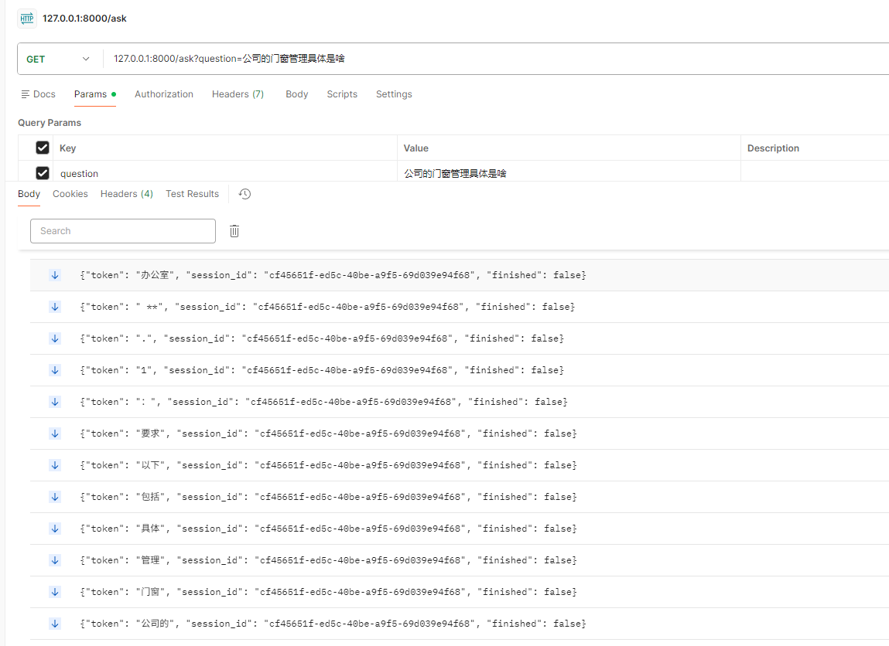
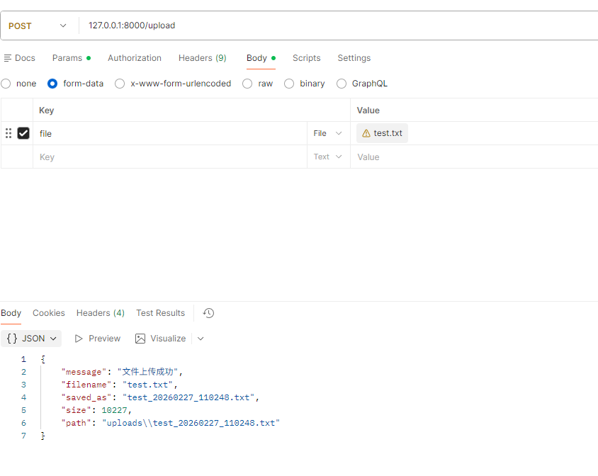
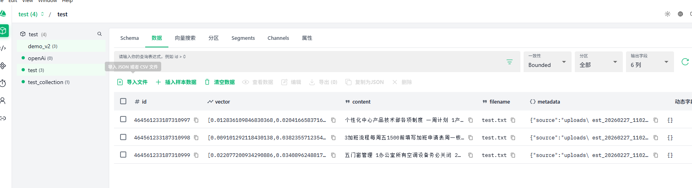
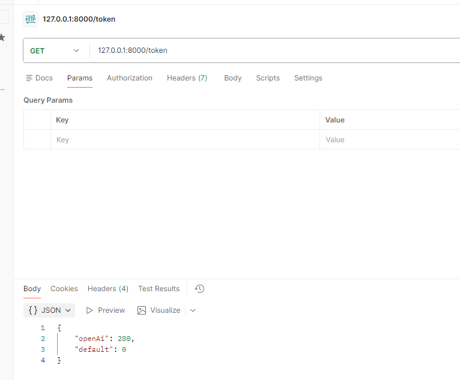
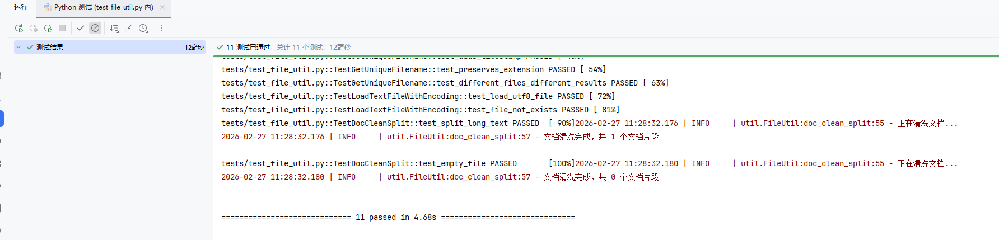

# RAG Knowledge Base Q&A System - Technical Architecture

An enterprise-grade RAG (Retrieval-Augmented Generation) knowledge base Q&A system built with LangChain + Milvus.

---

## 1. System Architecture

### Overall Architecture

```
1. Client Layer
 - Web / App / Browser frontend
 - Communicates via RESTful API
              │
              ▼
2. Controller Layer
 - FastAPI + Uvicorn + SSE streaming
 - /upload endpoint — file upload
 - /ask endpoint — question answering
 - /token endpoint — token usage statistics
               │
               ▼
3. Service Layer
 - Session management (using Session History)
 - RAG query pipeline
 - File upload pipeline
 ┌────────────────────┼───────────────┐
 ▼                    ▼               ▼
┌───────────────┐ ┌───────────────┐ ┌───────────────┐
│   Model Layer │ │   Data Layer  │ │   Util Layer  │
│               │ │  (Vector DB)  │ │               │
├───────────────┤ ├───────────────┤ ├───────────────┤
│ LLM Provider  │ │ Milvus        │ │  FileUtil     │
│ Embeddings    │ │               │ │  TextClean    │
└───────────────┘ └───────────────┘ └───────────────┘
```

### Architecture Highlights

| Layer | Responsibility | Technology |
|-----|----------------|---------------------------------|
| Controller | HTTP request handling, streaming output | FastAPI + SSE |
| Service | Business logic orchestration, session management | Python Async |
| Model | LLM invocation, vector embedding | LangChain |
| Data | Vector storage and retrieval | Milvus |
| Util | File processing, text cleaning | Custom utilities |

### Key Design Features

#### 1. Multi-Document Isolation

**Goal:** Isolate data across multiple documents.

**Implementation:**
- Add a `filename` field in the collection to store different files, providing data-level isolation.
- Store multiple original files distinguished by timestamps.

---

#### 2. Duplicate Embedding Prevention

**Goal:** Avoid redundant vector computation and storage for identical content, saving compute resources and storage space.

**Implementation:**
- 1. Compute MD5 hash of text before saving to the database.
- 2. Check if the hash already exists in the database.
- 3. If it exists, return directly without recomputing.
- 4. If not, store the document along with its MD5 hash.

### Tech Stack

| Component | Technology |
|--------|--------------------------------|
| Web Framework | FastAPI |
| RAG Framework | LangChain |
| Vector Database | Milvus |
| Embedding Model | bge-large-zh-v1.5 |
| LLM | OpenAI-compatible format (any model) + Mock |

---

## 2. Module Structure

### Module Dependencies

```
controller
    │
    ▼
service
    │
    ├──► db
    │       └──► model
    │
    ├──► model
    │
    └──► util
```

### Module Responsibilities

| Module | File | Responsibility | Key Classes / Methods |
|----------------|----------------------|---------------|------------------------------------------------------------------------|
| **controller** | `ragController.py` | API routing, request/response | `answer()`, `upload_single_file()` |
| **service** | `ragService.py` | RAG core pipeline, session management | `rag_qa()`, `rag_file_upload()` |
| **db** | `VectorDb.py` | Vector database CRUD | `retrieve_documents()`, `insert_documents_to_vector()` |
| **model** | `LlmProvider.py` | LLM abstract interface | `BaseLLMProvider.generate()` |
| **model** | `OpenAiLlm.py` | OpenAI-compatible implementation | `OpenAiLlm.generate()` |
| **model** | `MockAiLlm.py` | Mock implementation | `MockAiLlm.generate()` |
| **model** | `LocalEmbeddings.py` | Local embedding model | `embed_query()`, `embed_documents()` |
| **util** | `FileUtil.py` | File loading, text cleaning | `load_text_file_with_encoding()`, `clean_text()` |

### Design Principles

1. **Single Responsibility**: Each module handles one functional domain.
2. **Dependency Inversion**: The service layer depends on abstractions (`BaseLLMProvider`), not concrete implementations.
3. **Replaceability**: LLM Provider can be easily swapped (OpenAI / Mock / others).

---

## 3. RAG Pipeline

### Complete Flow

```
User Question
   │
   ▼
1. Session Management
 - Check session_id
 - Load conversation history
 - Generate new session_id (first visit)

   │
   ▼
2. Vector Retrieval
 - Embed user question using the Embedding model
 - Retrieve Top-K similar documents from the vector store (similarity must exceed configured threshold)
 - Return relevant document chunks

   │
   ▼
3. Prompt Construction
 - Concatenate retrieved context
 - Fill into Prompt template
 - Append conversation history

   │
   ▼
4. LLM Generation
 - Stream LLM API calls
 - Return tokens in real time
 - Track token usage

   │
   ▼
5. Response Output
 - Stream response to frontend via SSE
 - Save conversation history to session
```

---

## 4. Prompt Design

### Current Prompt Template

```python
PROMPT_CONTENT = """
You are a rigorous enterprise knowledge base assistant that strictly follows information retrieval principles. Answer the user's question precisely based on the provided context. Follow these rules:
            1. **Source Limitation**: Only use information from the context. Do not introduce external knowledge or personal inference.
            2. **Faithful Response**: If the context lacks sufficient information, respond: "No relevant content found." Do not fabricate or speculate.
            3. **Citation & Highlighting**: Highlight key facts or data in the answer with **double asterisks**, and display the citation source after each reference, also highlighted with **double asterisks**.
            4. **Answer Structure**: Answer the question directly first, then provide citation details. Keep answers concise and relevant.

            Context:
            {context}

            Question:
            {question}

            Example answer format:
            - With relevant information: Based on the context, XXX is... **quoted原文**... *source file*
            - Without relevant information: No relevant content found.

            Please begin your answer:
"""
```

### Design Principles

| Principle | Description | Implementation |
|-------------------|--------|----------------|
| **Role Definition** | Define the assistant's role | "Rigorous enterprise knowledge base assistant" |
| **Boundary Constraint** | Limit response scope | "Only use information from the context" |
| **Anti-Hallucination** | Prohibit fabrication | "Do not fabricate or speculate" |
| **Citation & Source** | Require source attribution | "Double asterisks highlighting + source display" |
| **Structured Output** | Clear output format | "Answer first, then cite" |
| **Few-Shot Learning** | Provide examples | "Example answer format" |

---

## 5. Anti-Hallucination Strategies

### Current Measures

| Measure | Implementation | Description |
|--------------|-----------------|-----------------|
| **Source Limitation** | Prompt template | "Only answer using information from the context" |
| **Unknown Declaration** | Prompt template | "No relevant content found" |
| **Citation Requirement** | Prompt template | "Double asterisks highlighting + source display" |
| **Top-K Retrieval** | `ragService.py` | Return multiple relevant chunks to reduce information gaps |
| **Similarity Threshold** | SIMILARITY config | Skip retrieval when similarity is below the threshold |

### Future Enhancements

- Upgrade to Agentic RAG architecture with AI agents — add a verification agent after retrieval to check for hallucinated content.

---

## 6. Scaling to 100K QPS

### Optimization Strategies

#### 1. Gateway Layer Optimization
Distribute requests via Nginx to multiple gateways, configure DDoS prevention, and deploy multiple Nginx instances with Keepalived.

#### 2. Cache Layer Optimization
Add caching for hot content to reduce repeated retrieval and LLM calls.

#### 3. Vector Retrieval Optimization
Split collections (sharding) for better retrieval throughput.

#### 4. LLM Call Optimization
Route complex tasks to high-accuracy models and simple tasks to fast-responding models.

#### 5. Embedding Model Optimization
Deploy embedding models on GPU for faster inference.

#### 6. Architecture Upgrade
- Multi-node deployment with distributed architecture.
- Load balancing via API gateway with appropriate policies.
- Database cluster deployment.

---

## 7. Smooth Embedding Model Migration

### Migration Challenges

| Challenge | Description |
|-----------|--------------------|
| **Vector Incompatibility** | New and old models produce different dimensions/distributions — vectors cannot be mixed directly |
| **Data Consistency** | New and old data coexist during migration |
| **Service Downtime** | Full re-embedding takes time and may impact service |
| **Rollback Difficulty** | Need quick rollback if issues arise after upgrade |

### Solution: Dual-Write + Gradual Migration

Steps:

- 1. Create a new collection that uses the new Embedding model.
- 2. Modify code to perform dual-write: write data using the old model to the old collection and the new model to the new collection simultaneously.
- 3. Deploy the updated code and record the dual-write start time.
- 4. Write a script to backfill data from before the dual-write start time into the new collection using the new model.
- 5. Verify both collections to confirm migration correctness.
- 6. Remove dual-write logic, switch fully to the new model and new collection, and deploy.

Rollback Plan

- Update configuration to switch back to the old model and old collection.

---

## 8. Testing

- 1. Q&A endpoint test
  
- 2. File upload test
  
  
- 3. Token statistics endpoint test
  
- 4. Unit tests (run tests under the `tests/` directory)
  

---

## 9. Getting Started

- 1. Build the Docker image: `sudo docker build -t rag-project:latest .`
- 2. Start the container:
```bash
sudo docker run -d \
  --name rag-app \
  -p 8000:8000 \
  -v $(pwd)/.env:/app/.env \
  -v $(pwd)/uploads:/app/uploads \
  -v $(pwd)/logs:/app/logs \
  --restart unless-stopped \
  rag-project:latest
```
